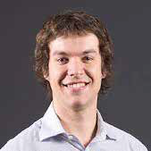

```{r setup, include=FALSE}
knitr::opts_chunk$set(collapse = TRUE)
```

## Jobs Outside the Bubble 1 - the first in our seminar series

Recently, many of you joined us in conversation with two outstanding brain scientists who have secured jobs outside of the university sector.  How did they do it? What is it like outside the bubble?  Whether you’re thinking about making a move, or are mentoring someone in this position, this webinar is for you. This promised to be an engaging and informative webinar, and indeed it delivered! Below is the link where you can watch it if you missed it. 

Chaired by Dr Bernadette Fitzgibbon (Monash University) and A/Prof Hannah Keage (UniSA)

22 July 2pm (Melbourne/Sydney time)

[Jobs Outside the Bubble 1](https://unisa.au.panopto.com/Panopto/Pages/Viewer.aspx?id=fb0502c0-3348-4cfb-99a7-ad6d0053ade2)




