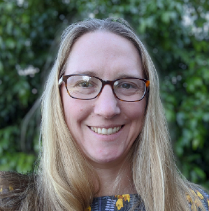

```{r setup, include=FALSE}
knitr::opts_chunk$set(collapse = TRUE)
```

## Jobs Outside the Bubble 2 - the second in our seminar series

Recently, some of you joined us in conversation with two more outstanding brain scientists who have secured jobs outside of the university sector. How did they do it? What is it like outside the bubble?  Whether you’re thinking about making a move, or are mentoring someone in this position, this webinar is for you. This was such an engaging and informative webinar! Below is the link for the YouTube video of the whole seminar. 

### Speakers




National Disability Insurance Agency 


Victoria Police 

Chaired by the Brain Science Network. 

September 14th, 1-2pm (Melbourne/Sydney time)

`r htmltools::HTML("")`


