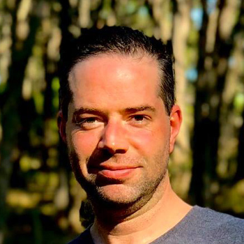

```{r setup, include=FALSE}
knitr::opts_chunk$set(collapse = TRUE)
```

## Jobs Outside the Bubble 3 - the third in our seminar series

Please join us in conversation with two outstanding brain scientists who have secured jobs outside of the university sector.
How did they do it? What is it like outside the bubble? Whether you’re thinking about making a move, or are mentoring someone in this position, this webinar is for you.

This promises to be an engaging and informative webinar. 

### Speakers





Chaired by the Brain Science Network. 

April 8th, 1-2pm (Melbourne/Sydney time)


`r htmltools::HTML("")`


