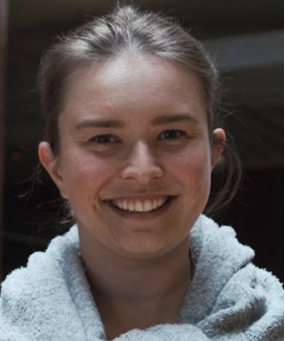

```{r setup, include=FALSE}
knitr::opts_chunk$set(collapse = TRUE)
```

## Jobs Outside the Bubble 4 - the fourth in our seminar series

Recently some of you joined us us in conversation with two outstanding brain scientists who have secured jobs outside of the university sector.

How did they do it? What is it like outside the bubble? Whether you’re thinking about making a move, or are mentoring someone in this position, this webinar series is for you.

For those of you who missed it, the YouTube recording is embedded below! 

### Speakers





Chaired by the [Brain Science Network](https://emcrbrainsciencenetwork.com.au/). 

Friday September 2nd, 1-2pm (Melbourne/Sydney time)

`r htmltools::HTML("")`


