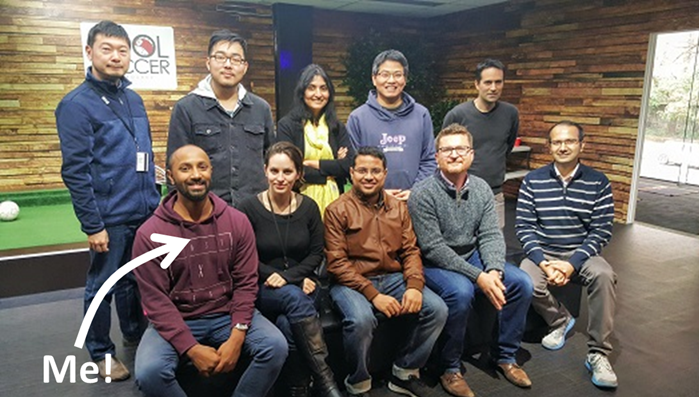
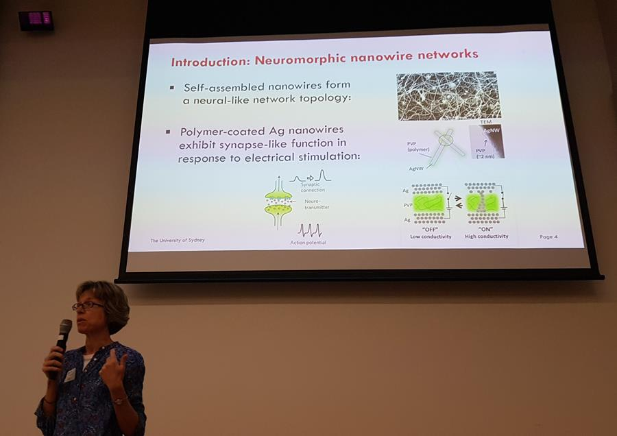
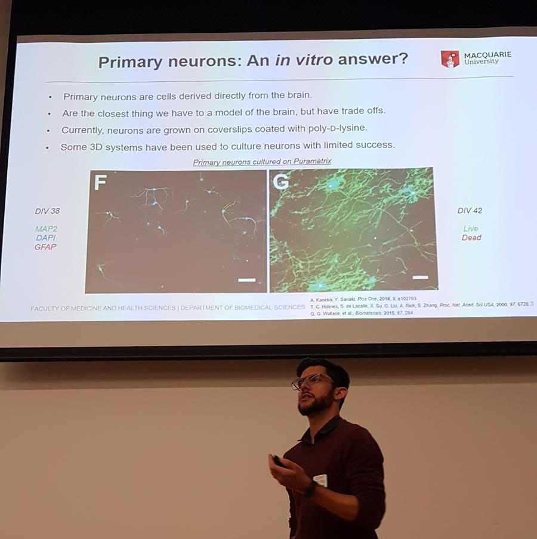
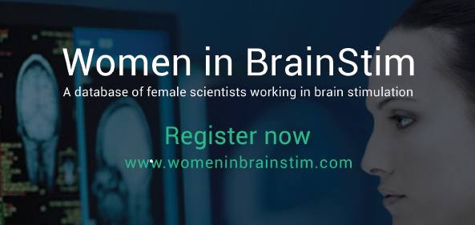

```{r setup, include=FALSE}
knitr::opts_chunk$set(collapse = TRUE)
thematic::thematic_off()
#library(tidyverse)
```

# Quarterly Newsletter, Edition 2, 2019

## Update on ABA EMCR network activities 
Over the past couple of months, the steering committee of our Australian Brain Alliance Early-to-Mid Career Brain Science Network (ABA EMCR BSN!) has seen a boost. We have welcomed and are currently welcoming a number of new members from across the ABA member organisations.

In this second edition of our newsletter in 2019, we introduce several EMCRs pushing the boundaries in brain science across Australia. We also have an interesting story of how an internship in industry may help you follow your passion while studying a PhD. If you have an interesting story to tell about your research, we would be delighted to include it in our future issues. We would also love to hear and include information about various brain science events across Australia and the globe. Get in touch and let us know your amazing brain science stories and upcoming vibrant events.

We hope you enjoy being a part of the BSN, and please check our website and 
follow us on Twitter @EMCRBrainAu and LinkedIn. If you want to reach out to us with any questions or feedback, or advertise any events relevant to BSN members, please email us.

On behalf of The Brain Science Network steering committee,
Mostafa and Mayuresh

##  An internship to help beat breast cancer, mind-control a robotic hand, and synergise AI and neuroscience to treat epilepsy—all while doing a PhD 
### By Shivy Yohanandan



After completing a double-major in neuroscience and bioengineering, I dived right into a PhD in artificial intelligence (AI) because I wanted to synergise the two fields. But once I started, I felt that theory wasn’t enough. So, I searched for an internship that would complement the PhD. I wanted to do cool stuff at the intersection of neuroscience, engineering and AI, and learn a lot more about machine learning, particularly practical applications-based stuff. Fortunately, an internship at IBM Research in Melbourne promised just that.

I joined IBM Research in 2016 and landed in an amazing and diversely-skilled research group—the Brain Inspired Computing team. It was a perfect match because the stuff they did was right up my alley. My first project was to work on the DREAM breast cancer detection challenge—a moonshot initiative by former US Vice President Joe Biden to develop deep learning algorithms capable of detecting breast cancer from mammograms as early as possible. I was part of the organising team and was proud to have made a significant contribution on the dataset preparation and analysis side of things. We also had to build the challenge infrastructure and baseline algorithms that participants had to beat as a minimum requirement. $1 million prize money was at stake so this was some serious stuff!

No role is too small or insignificant, not even an internship; what you do really matters. I went on to make lots of new friends that year and learned a lot. And best of all, everything I did complemented the PhD. PhD research is often basic or fundamental, so it’s always nice to get your hands dirty doing applied research that can have a more immediate impact.

I was fortunate to get an internship extension to work on something completely different: brain computer interfaces (BCIs). I had the privilege of building a BCI and developing software and machine learning algorithms (from scratch) and testing it out on colleagues. The aim was to build a BCI for locked-in syndrome sufferers to communicate with the outside world and control a robotic hand to pick up objects using their thoughts alone. This was extremely satisfying, but the highlight was definitely hacking it to play 'brain-pong', where a live tournament was held in the lab for all to see Brendon (aka Braindon) go 'head-to-head' with Isabell (aka Isabetterthanbraindon)! A climactic conclusion to that project, which also made a debut on TV. And as if that wasn’t enough, I was given a fantastic opportunity to present our research in Hawaii.

I’m now, after yet another internship extension, working on the team’s main effort: AI-powered epileptic seizure detection and classification, and my focus is video analytics to do this. However, while taking some time off the PhD enabled me to do these cool and amazing things, there certainly were challenges trying to juggle everything. For starters, the initial internship cost me three months of my PhD, which meant I had a lot of catching up to do once it concluded. And although the subsequent internships were part-time, I had to sacrifice many evenings and weekends to keep up. Nevertheless, I still think it was worth it and I’m thoroughly enjoying it here. It's a great place to work full of great minds and good friends.

## Nano-Brain Research Symposium
### By Olga Shimoni

The inaugural Nano-Brain Research Symposium was held on Monday 1 April 2019 at Macquarie University in Sydney. The goal of this symposium was to bring together researchers with diverse expertise in nanoscience and the brain to share information, address key problems, accomplish advances and achieve major impact in the field. Nanotechnology has a tremendous opportunity to contribute to neuroscience and brain research. The symposium was an opportunity to exchange ideas, discuss research challenges and forge new research collaborations. The organisers of Nano-Brain also aimed to enhance communication and participation among basic research scientists, translational researchers and clinicians to create multidisciplinary tactics in advancing this field.

The symposium attracted many high-calibre speakers and attendees across Sydney. It included nine invited speakers from several universities across Sydney covering numerous aspects of applications of nanotechnology in brain research.



Professor Ralph Martins (Macquarie University), a world-leading researcher into Alzheimer’s disease, opened the first session of the symposium delivering a plenary talk about the evolution of research in Alzheimer’s disease over the last 20 years. He covered how the field has advanced from discovering the hallmarks of this disease, to delivering blood test for Alzheimer’s disease and also on novel nanotechnology-based methods developed in his lab. In addition, Professor Zdenka Kuncic (The University of Sydney, pictured above) talked about whether neuromorphic nanotechnology can mimic neural circuits, raising the question if a synthetic brain could be a possibility in the future. Next, Associate Professor Olga Shimoni gave an overview of her research at the University of Technology Sydney, on the applications of various nanoparticles for treatment and diagnostics of brain disorders. 



In the second session, Professor Yi Qian, Dr Adam Martin (pictured above) and Dr Lindsay Parker from Macquarie University shared their insights on the application of mechanical engineering to cerebrovascular diseases, developing peptide hydrogels to culture primary neurons and targeting sugar-coated nanoparticles to brain cells, respectively. In the final session for the day, Associate Professor Elizabeth New (University of Sydney) delivered an exciting talk about bionanosensors to study cellular activity, while Marina Ulanova (University of New South Wales) and Dr Bingyang Shi (Macquarie University) provided different views on delivering nanoparticles across the blood-brain-barrier. 

The symposium concluded with a networking opportunity to discuss potential collaborations, future prospects, and potential new directions. The next Nano-Brain Research Symposium is tentatively scheduled to occur in conjunction with the International Conference in BioNano Innovation 2020 (ICBN2020) that will be part of the International Conference On Nanoscience and Nanotechnology (ICONN2020) in Brisbane, Queensland. For more information about the upcoming symposium and expressions of interest to participate, please email [olga.shimoni@uts.edu.au](mailto:olga.shimoni@uts.edu.au) 

## Brain Science EMCR profiles

Today we're profiling two talented EMCR brain researchers, [A/Prof. Tara Hamilton](/profiles/a-prof-tara-hamilton) and [Dr. Kristi Griffiths](/profiles/dr-kristi-griffiths).


## Grant Opportunities

Please [contact](mailto:emcrbsn@brainalliance.org.au) the EMCR Network if you would like to advertise grant opportunities here.


## Employment and other brain science opportunities

Please [contact](mailto:emcrbsn@brainalliance.org.au) the EMCR Network if you would like to advertise positions here.

[](http://womeninbrainstim.com/)


