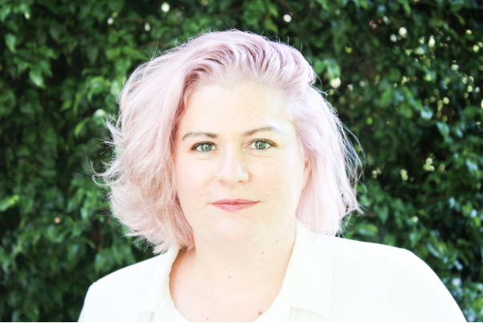

```{r setup, include=FALSE}
knitr::opts_chunk$set(collapse = TRUE)
```





Correct brain development is critically dependent on genetic and environmental cues and signals. However, when the process goes wrong it can result in a malformation of brain development (MBD) and associated neurodevelopmental disorders such as intellectual disability and epilepsy.

MBD are relatively common and are a heavy burden for families, as affected individuals often require lifelong multidisciplinary care from health and community services. There are over 100 new patients seen every year at the Royal Children’s Hospital in Melbourne. To better understand and treat MBD we have established a multidisciplinary clinical and laboratory research program at the Murdoch Children’s Research Institute. This combination of researchers across multiple disciplines is essential to enable understanding of these conditions and translate the results back to patients and families.

One area of focus is to study the dysplastic brain lesions that are removed during epilepsy surgery. Many of these lesions have histopathological features strikingly similar including highly localised dysplastic cortical tissue that is distinguished by neuronal dyslamination, dysmorphology and immaturity. We also collect patient tissue and generate stem cells to undertake disease modelling. I’m a molecular biologist with expertise in using advanced genomic technologies including targeted deep sequencing and high throughput single cell RNAseq to study MBD. I want to understand the developmental process underlying to lesion formation and their potent intrinsic ability to cause seizures that suddenly switch on and off and are largely drug resistant. Ultimately it is my goal to identify and develop targeted medical therapies for paediatric brain disorders to then take back to the patient in the form of clinical trials.

I’m also the co-founder of an organisation called QueersInScience which aims to foster and champion the inclusion of LGBTQIA+ professionals within STEMM organisations. QueersInscience came together in early 2018 as a statement of pride, belonging, empowerment and support of the LGBTQIA+ community in STEMM. Everyone should feel welcome and safe in their workplaces and we encourage all STEMM organisations to embrace and champion inclusivity. We are driven by four cornerstones:

## Visibility

To empower emerging and established LGBTQIA+ professionals working in STEMM, and to showcase the important contributions that members of the LGBTQIA+ community make to the field of science in Australia.

## Advocacy

To work within STEMM organisations to implement best practice policies that promote safe and inclusive workplaces for all individuals who identify as LGBTQIA+.

## Networking

To provide a safe and inclusive nexus for LGBTQIA+ individuals in STEMM to engage in social and professional networking, with mentoring opportunities for LGBTQIA+ students and early-career researchers to meet with leaders in their field.

## Education

To raise awareness of the roles that STEMM organisations and colleagues play in creating a welcoming environment for LGBTQIA+ individuals, by debunking stereotypes and providing resources that help implement inclusive policies, language, terminology, and pronouns.

If you are interested in getting involved or learning more about our initiatives, please get in contact via [queersinscienceAU@gmail.com](mailto:queersinscienceAU@gmail.com) and follow us on twitter [QueersInScience](https://twitter.com/queersinscience)

*We are using “Queer” as an inclusive term to encompass people who identify as Lesbian, Bisexual, Gay, Transgender, Intersex, Asexual and any other of the many and varied identities that make up our rainbow community.

